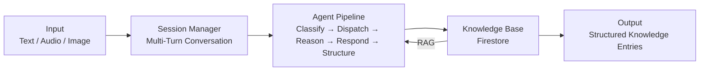

<!-- Logo: TODO – Add Mycel logo -->

# Mycel

**The AI-powered knowledge engine that grows with your community.**

Mycel captures decentralized, unstructured knowledge through AI-powered dialogues and transforms it into structured, queryable information. Users contribute knowledge through natural conversation — and a multi-agent system classifies, completes, and structures this knowledge in the background. Named after mycelium, the underground fungal network that distributes nutrients in a decentralized way, Mycel connects scattered knowledge into a living, breathing knowledge system.

## How It Works

You talk. Mycel listens, asks follow-up questions, and structures what you share.

```
You:   "The old village church was built in 1732 in Baroque style."
Mycel: "1732, Baroque — that's really old! Was it ever renovated?"
You:   "Yes, a new tower was added in 1890."
Mycel: "Fascinating! Anything else come to mind — maybe a local club or a special place?"
```

Behind the scenes, Mycel classifies the input, identifies knowledge gaps, asks naturally, and stores structured knowledge entries — all without the user noticing the complexity.

## Architecture



The engine is configured via two JSON schemas:
- **Domain Schema** — defines *what* knowledge to capture (categories, fields)
- **Persona Schema** — defines *how* to communicate (tone, style, language)

This makes Mycel domain-agnostic: the same engine can power a village knowledge base, a biography project, or any other knowledge collection use case.

## Tech Stack

| Layer           | Technology                          |
| --------------- | ----------------------------------- |
| Language        | TypeScript (strict mode)            |
| Runtime         | Node.js 20+                         |
| Cloud           | Google Cloud Platform               |
| AI / LLM        | Vertex AI (Gemini 1.5 Pro / Flash)  |
| Agent Framework | LangGraph.js                        |
| Database        | Cloud Firestore                     |
| Vector Search   | Vertex AI Vector Search             |
| Infrastructure  | Terraform                           |
| Validation      | Zod                                 |
| Testing         | Vitest                              |

## Getting Started

### Prerequisites

- Node.js 20+
- npm 10+
- GCP project with Vertex AI API enabled
- Terraform 1.5+ (for infrastructure provisioning)
- Java 21+ (for Firestore emulator)

### Install

```bash
npm install
npm run build
```

### Run an Interactive Session

```bash
# Terminal 1: Start the Firestore emulator
npm run emulator:start

# Terminal 2: Run the session
FIRESTORE_EMULATOR_HOST=localhost:8080 MYCEL_GCP_PROJECT_ID=your-project-id npx tsx scripts/run-session.ts
```

Type naturally. Type `done` or press `Ctrl+C` to end.

### Commands

| Command                  | Description                                      |
| ------------------------ | ------------------------------------------------ |
| `npm run build`          | Build all packages                               |
| `npm run test`           | Run unit tests                                   |
| `npm run test:integration` | Run Firestore integration tests (requires emulator) |
| `npm run lint`           | ESLint across all packages                       |
| `npm run typecheck`      | TypeScript type checking                         |
| `npm run format`         | Prettier formatting                              |
| `npm run emulator:start` | Start Firestore emulator on localhost:8080       |

## Project Structure

```
mycel/
├── packages/
│   ├── core/          # AI engine — agents, orchestration, repositories, RAG
│   ├── ingestion/     # Multimodal input processing (audio, image, text)
│   ├── schemas/       # Domain & Persona schema definitions + validation
│   └── shared/        # Shared types, utilities, logger
├── infra/             # Terraform — GCP infrastructure (dev/prod environments)
├── config/            # Default domain and persona schema JSON files
├── scripts/           # CLI tools (run-session, seed-schemas, run-pipeline)
├── docs/              # Architecture docs, ADRs, implementation plans
└── .github/           # CI/CD workflows
```

## Documentation

- [Architecture Overview](docs/architecture.md)
- [ADR-001: TypeScript Monorepo](docs/adr/001-typescript-monorepo.md)
- [ADR-002: GCP Infrastructure](docs/adr/002-gcp-infrastructure.md)
- [ADR-003: Multi-Agent Architecture](docs/adr/003-multi-agent-architecture.md)
- [ADR-004: Adaptive Schema Evolution](docs/adr/004-adaptive-schema-evolution.md)
- [ADR-005: Document Generator](docs/adr/005-document-generator.md)
- [ADR-006: Persistence Layer — Firestore](docs/adr/006-persistence-layer-firestore.md)
- [ADR-007: RAG Foundation — Firestore Vector Search](docs/adr/007-rag-foundation-firestore-vector-search.md)
- [ADR-008: API Layer — Hono on Cloud Run](docs/adr/008-api-layer-hono-cloud-run.md)
- [ADR-009: Conversation Quality — Intent-Aware Pipeline](docs/adr/009-conversation-quality-intent-aware-pipeline.md)

## License

Proprietary — All Rights Reserved. See [LICENSE](./LICENSE).