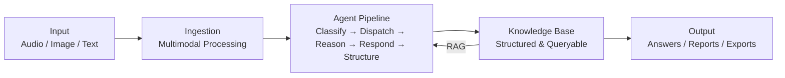

<!-- Logo: TODO – Add Mycel logo -->

# Mycel

**The AI-powered knowledge engine that grows with your community.**

Mycel captures decentralized, unstructured knowledge through AI-powered multimodal dialogues and transforms it into structured, queryable information. Users contribute knowledge through natural channels — voice, images, text — and a multi-agent system proactively classifies, completes, and structures this knowledge. Named after mycelium, the underground fungal network that distributes nutrients in a decentralized way, Mycel connects scattered knowledge into a living, breathing knowledge system.

## Architecture



## Tech Stack

| Layer           | Technology                          |
| --------------- | ----------------------------------- |
| Language        | TypeScript (strict mode)            |
| Runtime         | Node.js 20+                         |
| Cloud           | Google Cloud Platform               |
| AI / LLM        | Vertex AI (Gemini 1.5 Pro / Flash)  |
| Agent Framework | LangGraph.js                        |
| Vector Search   | Vertex AI Vector Search             |
| Infrastructure  | Terraform                           |
| Validation      | Zod                                 |
| Testing         | Vitest                              |

## Getting Started

### Prerequisites

- Node.js 20+ (see `.nvmrc`)
- npm 10+
- GCP account with Vertex AI enabled (for runtime features)
- Terraform 1.5+ (for infrastructure provisioning)

### Install

```bash
npm install
```

### Build

```bash
npm run build
```

### Lint & Type-Check

```bash
npm run lint
npm run typecheck
```

### Test

```bash
npm run test
```

### Format

```bash
npm run format
```

## Project Structure

```
mycel/
├── packages/
│   ├── core/          # AI engine – agents, orchestration, RAG pipeline
│   ├── ingestion/     # Multimodal input processing (audio, image, text)
│   ├── schemas/       # Domain & Persona schema definitions + validation
│   └── shared/        # Shared types, utilities, logger
├── infrastructure/    # Terraform – GCP resource definitions
├── docs/              # Architecture docs, ADRs, schema examples
└── .github/           # CI/CD workflows
```

## License

Proprietary – All Rights Reserved. See [LICENSE](./LICENSE).
