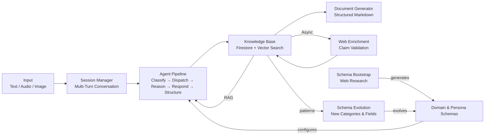

# Mycel


Mycel is an AI-powered Universal Knowledge Engine that captures unstructured knowledge through natural, multi-turn conversations and transforms it into structured, queryable information. Configured via JSON schemas — a Domain Schema (what to capture) and a Persona Schema (how to communicate) — the same engine can power any knowledge collection use case: a village chronicle, a biography project, or a product knowledge base.

### How It Feels

```
You:   "The old village church was built in 1732 in Baroque style."
Mycel: "1732, Baroque — that's really old! Was it ever renovated?"
You:   "Yes, a new tower was added in 1890."
Mycel: "Fascinating! Anything else come to mind — maybe a local club or a special place?"
```

You talk. Mycel listens, asks follow-up questions, and structures what you share — all without the user noticing the complexity behind the scenes.

## Key Features

- **Multi-Agent Pipeline** — Classifier, Context Dispatcher, Gap-Reasoning, Persona, and Structuring agents work together to understand, complete, and structure knowledge
- **Dynamic Schema Bootstrap & Evolution** — Generate domain schemas from a plain-text description using web research; evolve them over time as conversation patterns reveal new categories
- **RAG (Cross-Session Recall)** — Retrieval-augmented generation via Firestore Vector Search brings prior knowledge into new conversations
- **Real-time Web Enrichment** — Claims are extracted from conversations and validated against web sources asynchronously
- **Document Generation** — Auto-generates structured Markdown knowledge bases from collected entries
- **Anonymous Auth with Tenant Isolation** — GCP Identity Platform JWTs with all data scoped under `tenants/{tenantId}/`
- **Interactive API Docs** — Auto-generated OpenAPI 3.1 spec with Scalar API Reference UI at `/docs`

## Tech Stack

| Layer | Technology |
|---|---|
| API | [Hono](https://hono.dev) + [@hono/zod-openapi](https://github.com/honojs/middleware/tree/main/packages/zod-openapi) |
| Language | TypeScript (strict mode) |
| AI / LLM | Vertex AI (Gemini), LangGraph.js |
| Database | Cloud Firestore + Vector Search |
| Auth | GCP Identity Platform (anonymous JWT) |
| Hosting | Cloud Run |
| Infrastructure | Terraform |
| Testing | Vitest |

## Getting Started

### Prerequisites

- Node.js 20+, npm 10+
- Java 21+ (for Firestore emulator)
- GCP project with Vertex AI API enabled (or use `MYCEL_MOCK_LLM=true` for local dev without GCP)

### Install & Build

```bash
npm install
npm run build
```

### Environment Setup

```bash
cp .env.example .env
# Edit .env — at minimum set MYCEL_GCP_PROJECT_ID
# For local dev without GCP, keep MYCEL_MOCK_LLM=true
```

### Local Development

```bash
# Terminal 1: Start Firestore emulator
npm run emulator:start

# Terminal 2: Start the API server
npm run dev:api
# → http://localhost:8080
```

### Seed Default Schemas

```bash
npm run seed:schemas
```

This loads the default Domain and Persona schemas from `config/` into Firestore.

### Running Tests

```bash
npm run test              # Unit tests
npm run test:integration  # Integration tests (requires emulator)
npm run lint              # ESLint
npm run typecheck         # TypeScript type checking
```

## API Documentation

With the API server running, open [http://localhost:8080/docs](http://localhost:8080/docs) for the interactive Scalar API Reference UI. The raw OpenAPI spec is available at `/openapi.json`.

**Core endpoints:**

| Method | Path | Description |
|---|---|---|
| `POST` | `/sessions` | Start a new conversation session |
| `POST` | `/sessions/:id/turns` | Submit a user message |
| `POST` | `/sessions/:id/end` | End a session |
| `POST` | `/domains/generate` | Generate a domain schema from a description |
| `POST` | `/domains/:id/documents/generate` | Generate a knowledge document |
| `POST` | `/domains/:id/evolution/analyze` | Analyze knowledge for schema evolution |

## Deployment

Deploy to Cloud Run using the included script:

```bash
export MYCEL_GCP_PROJECT_ID=your-project-id
# Optional: export MYCEL_GCP_REGION=europe-west3 (default)
./scripts/deploy.sh
```

This builds a `linux/amd64` Docker image, pushes it to Artifact Registry, and updates the Cloud Run service.

## Architecture



The **Agent Pipeline** processes each user turn through five specialized agents:

1. **Classifier** — Categorizes input against the domain schema
2. **Context Dispatcher** — Retrieves relevant prior knowledge (RAG)
3. **Gap-Reasoning** — Identifies missing information and formulates follow-up questions
4. **Persona** — Generates a natural response in the configured communication style
5. **Structuring** — Extracts and structures knowledge entries from the conversation

The engine is fully configured by two JSON schemas — no domain logic is hardcoded.

For more detail, see the [Architecture Overview](docs/architecture.md) and [ADRs](docs/adr/).

## Project Structure

```
mycel/
├── packages/
│   ├── api/          # HTTP API (Hono, Cloud Run entrypoint)
│   ├── core/         # AI engine (agents, orchestration, RAG)
│   ├── ingestion/    # Multimodal input processing
│   ├── schemas/      # Domain & Persona schema definitions
│   └── shared/       # Shared types, utilities, logger
├── config/           # Default schema JSON files
├── docs/             # Architecture docs & ADRs
├── infra/            # Terraform (GCP infrastructure)
└── scripts/          # CLI tools & deployment
```

## License

Proprietary — All Rights Reserved. See [LICENSE](./LICENSE).
