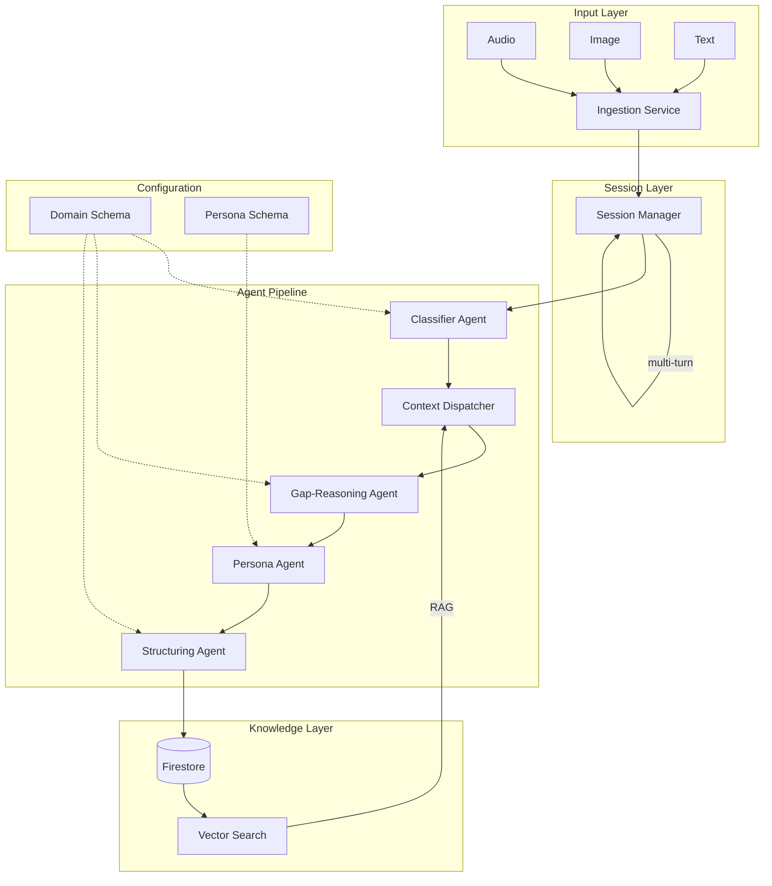
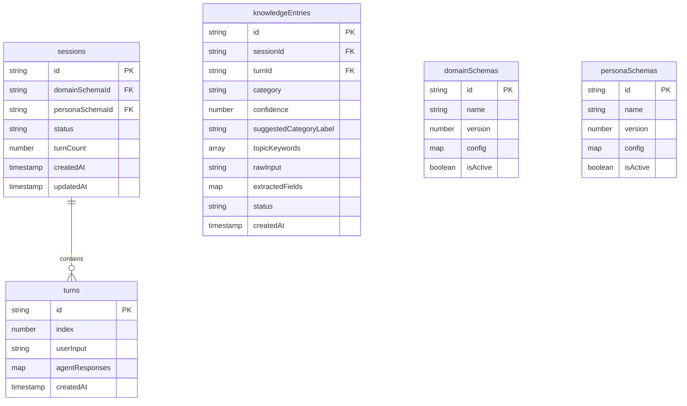
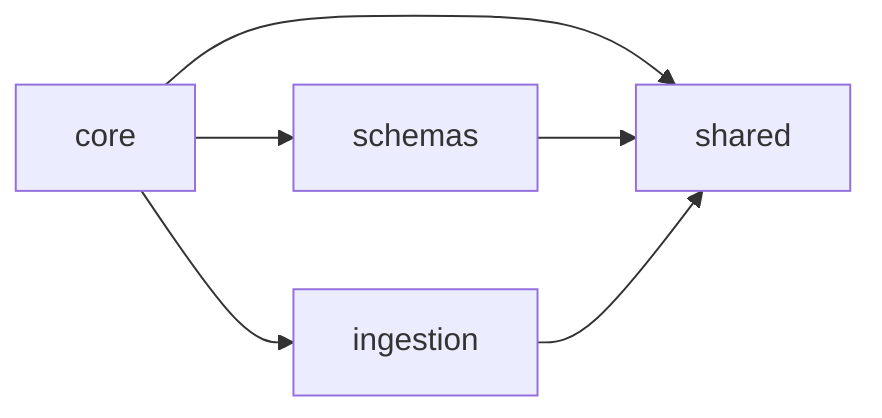
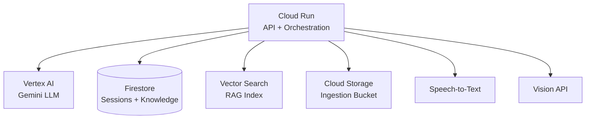

# Mycel – Architecture Overview

## System Architecture

## Core Concepts

### Genericity through Configuration

Mycel separates three concerns:

1. **Engine** – The agent pipeline, orchestration logic, and infrastructure. Domain-agnostic.
2. **Domain Schema** – Defines *what* knowledge to capture: categories, required fields, ingestion modalities.
3. **Persona Schema** – Defines *how* to communicate: tone, formality, follow-up behavior.

A deployment is fully configured by providing a Domain Schema and a Persona Schema. The engine itself never contains domain-specific logic.

### Multi-Agent System

Instead of a single monolithic prompt, Mycel uses specialized agents:

| Agent              | Responsibility                                                  | LLM Model     |
| ------------------ | --------------------------------------------------------------- | -------------- |
| Classifier         | Categorizes input into domain categories or `_uncategorized`    | Gemini Flash   |
| Context Dispatcher | Retrieves relevant existing knowledge (RAG)                     | –              |
| Gap-Reasoning      | Identifies missing information and generates follow-up questions| Gemini Pro     |
| Persona            | Formulates the response in the configured persona style         | Gemini Flash   |
| Structuring        | Extracts structured data from the conversation                  | Gemini Pro     |

All agents produce Zod-validated JSON output. Prompts are tuned to handle malformed responses (markdown-wrapped JSON, retries on parse failure).

### Session Management

The Session Manager orchestrates multi-turn conversations:

- Each session references a Domain Schema and Persona Schema
- Conversation state accumulates across turns (previous turns inform gap analysis)
- Sessions have a lifecycle: `active` → `completed` | `abandoned`
- Completeness is evaluated after each turn based on configurable thresholds (`autoCompleteThreshold`, `maxTurns`)

Individual turns are stored as a subcollection, keeping session documents lightweight while supporting unbounded conversation length.

### Adaptive Schema Evolution (ADR-004)

The system does not force knowledge into rigid categories. Key principles:

- **`_uncategorized` is valid**: If input doesn't fit any category with sufficient confidence, the Classifier assigns `_uncategorized` rather than forcing a bad fit.
- **Every entry carries metadata for future clustering**: `suggestedCategoryLabel`, `topicKeywords[]`, and `rawInput` are preserved even for well-classified entries.
- **Migration-ready lifecycle**: Entries have a `status` field (`draft` → `confirmed` → `migrated`) to support future re-classification of `_uncategorized` entries into proper categories.
- **Adaptive questioning**: The Gap-Reasoning agent asks only what the user is likely to know, not a rigid list of missing fields.

The system learns its own schema over time rather than relying on predefined categories alone.

### Ingestion Pipeline

The ingestion layer normalizes multimodal input into text:

- **Audio**: Speech-to-Text via Vertex AI (not yet implemented)
- **Image**: Vision API for OCR and object detection (not yet implemented)
- **Text**: Direct processing with language detection

## Persistence Layer

### Repository Pattern

All data access goes through interfaces with injectable implementations:

| Interface             | Production           | Testing               |
| --------------------- | -------------------- | --------------------- |
| `SessionRepository`   | Firestore            | In-Memory             |
| `KnowledgeRepository` | Firestore            | In-Memory             |
| `SchemaRepository`    | Firestore            | In-Memory             |

Repositories are injected into the Session Manager via dependency injection. No code imports Firestore directly outside the repository implementations.

### Firestore Collections

**Key design decisions:**
- `turns` is a subcollection of `sessions` (scales better than an embedded array)
- `knowledgeEntries` is a top-level collection (must be queryable across sessions)
- `topicKeywords` is an array field for `array-contains` queries (future clustering)
- Composite indexes on `knowledgeEntries`: `category` + `createdAt`, `status` + `createdAt`

## Package Dependencies

## GCP Infrastructure

All infrastructure is provisioned via Terraform (`infra/terraform/`), with per-environment configurations and shared modules. Dev environment uses Firestore Emulator for local development.

## Current State

| Component               | Status       |
| ----------------------- | ------------ |
| Agent Pipeline           | ✅ Complete  |
| Multi-Turn Sessions      | ✅ Complete  |
| Real LLM (Vertex AI)    | ✅ Complete  |
| Adaptive Schema (ADR-004)| ✅ Complete  |
| Persistence (Firestore)  | ✅ Complete  |
| Terraform (Dev)          | ✅ Complete  |
| API Layer (Cloud Run)    | ⬚ Planned   |
| RAG Foundation           | ⬚ Planned   |
| Audio Ingestion          | ⬚ Planned   |
| Image Ingestion          | ⬚ Planned   |
| Auth & Multi-Tenancy     | ⬚ Planned   |
| Monitoring               | ⬚ Planned   |