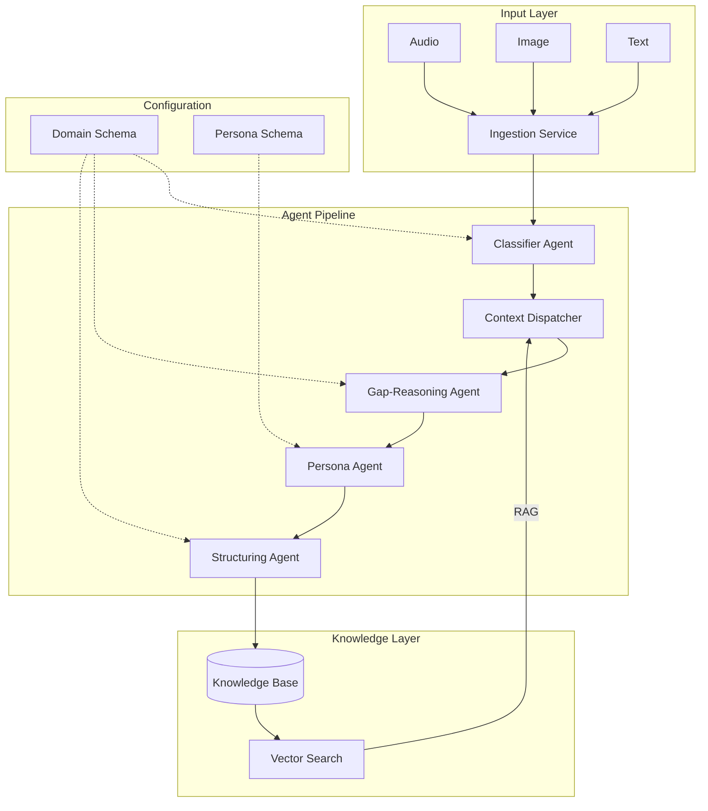
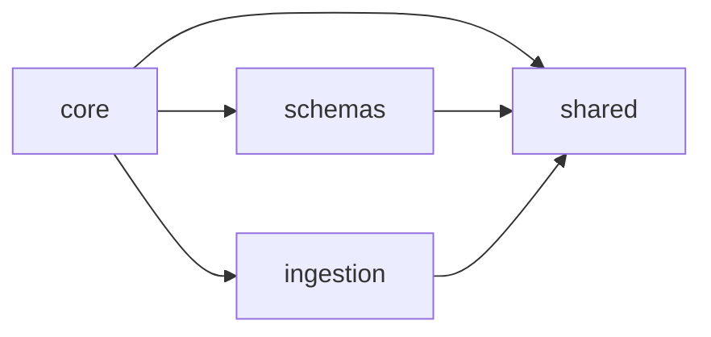
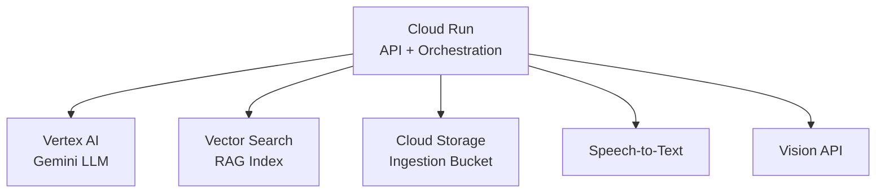

# Mycel – Architecture Overview

## System Architecture

## Core Concepts

### Genericity through Configuration

Mycel separates three concerns:

1. **Engine** – The agent pipeline, orchestration logic, and infrastructure. Domain-agnostic.
2. **Domain Schema** – Defines *what* knowledge to capture: categories, required fields, ingestion modalities.
3. **Persona Schema** – Defines *how* to communicate: tone, formality, follow-up behavior.

A deployment is fully configured by providing a Domain Schema and a Persona Schema. The engine itself never contains domain-specific logic.

### Multi-Agent System

Instead of a single monolithic prompt, Mycel uses specialized agents:

| Agent               | Responsibility                                          |
| ------------------- | ------------------------------------------------------- |
| Classifier          | Categorizes input into domain categories                |
| Context Dispatcher  | Retrieves relevant existing knowledge (RAG)             |
| Gap-Reasoning       | Identifies missing information and generates questions  |
| Persona             | Formulates the response in the configured persona style |
| Structuring         | Extracts structured data from the conversation          |

### Ingestion Pipeline

The ingestion layer normalizes multimodal input into text:

- **Audio**: Speech-to-Text via GCP Speech API
- **Image**: Vision API for OCR and object detection
- **Text**: Direct processing with language detection

### RAG (Retrieval Augmented Generation)

The Context Dispatcher uses Vertex AI Vector Search to retrieve relevant existing knowledge before the Gap-Reasoning agent analyzes what is missing. This prevents duplicate knowledge and enables the system to build on existing entries.

## Package Dependencies

## GCP Infrastructure

